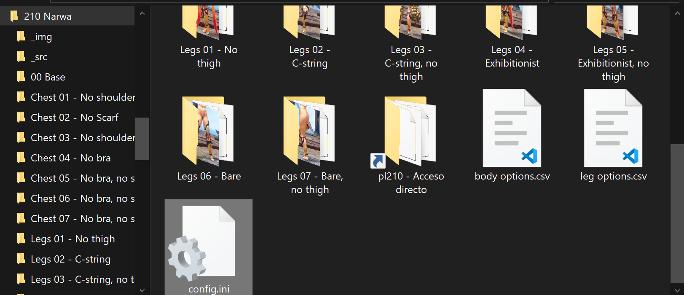

# Folder structure

The folder to be compressed can have whatever structure you want; it doesn't care that much how many subfolders, non distributable files, whatever, you have in your folder... as long as it fits two conditions.

1. It **MUST** have a `config.ini` file.
2. Each subfolder that will be distributed as an armor option must contain the `modinfo.ini` file that Fluffy uses to recognize a folder as an option.

The image shows a functional mod that was actually packed using this program.

Notice how it has many folders and files that were never meant o be distributed.
