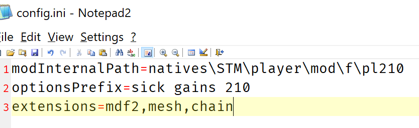
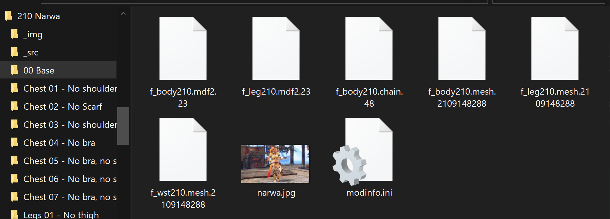
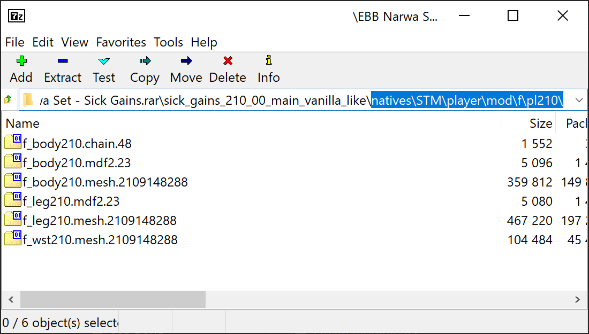
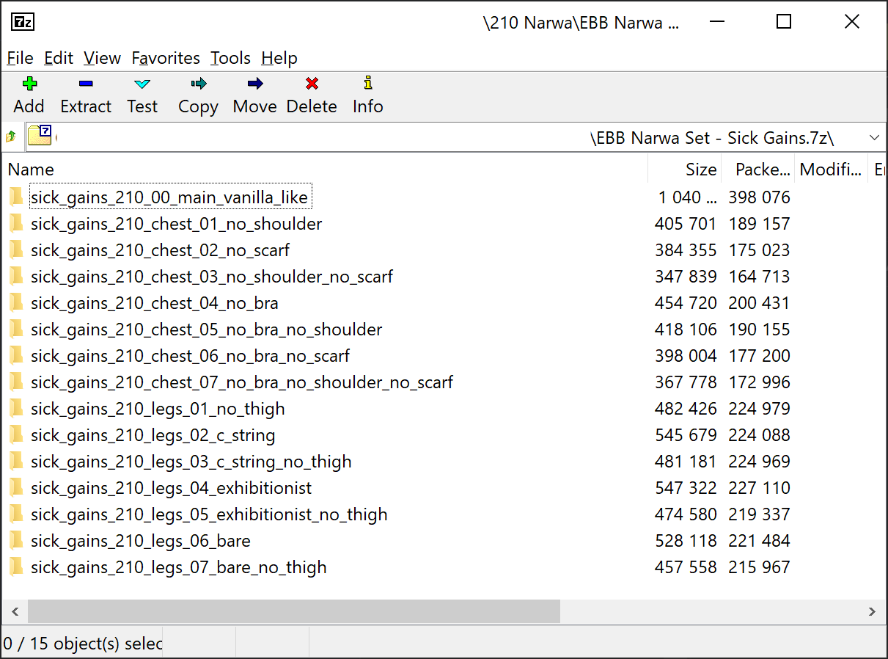

# Config.ini

This file contains data this program needs to function.

**This file won't be packed** and must be located just inside the folder you want to pack, next to all options subfolders.

In this case, `x:\some folders\210 Narwa` was dragged to ArmorPacker.exe.

Notice how there are many subfolders (most of them containing armor options), **but config.ini is right at `x:\some folders\210 Narwa\config.ini`**.

Also notice how this folder has some files not related to armor mod installation.\
All those files are ignored by Armor Packer.

# Variables

## modInternalPath

**_REQUIRED_**

This is the path where your files will be actually installed by Fluffy.

### Example

By assigning this variable the value `natives\STM\player\mod\f\pl210` you are telling all the files inside your mod will be installed inside that folder.

Notice how there are no subfolders inside `x:\some folders\210 Narwa\00 Base`, only files that will be actually distributed, yet thanks to this variable the generated \*.7z file correctly adds those files to `option_name\natives\STM\player\mod\f\pl210`.

## optionsPrefix

**_REQUIRED_**

For each armor option, this prefix will be prepended to the folder name for that option.

This is an anti-collision measure so your mod will play nicely with Fluffy Manager and other mods made for it.

### The collision issue

Name collisions happen when you add two different mods with the same folder name to Fluffy.

When that happens, the second installed folder becomes invisible and the user can't see your mod.

For example, if you had installed these two files:

    Astalos.rar
      00 Main
      Chest 01 - Variant 1

    Kamura.rar
      00 Main
      Legs 01 - Pants

You would see option `00 Main` for Astalos, but not for Kamura, since the folder names have exactly the same name.

The easiest way to solve this is to make sure all folder options are different, for example:

    Astalos.rar
      my_own_name_astalos_armor_00_main
      my_own_name_astalos_armor_chest_01_Variant_1

    Kamura.rar
      my_own_name_kamura_armor_00_main
      my_own_name_kamura_armor_legs_01_pants

This variable is used for that.

### Usage

If you had:

    optionsPrefix=sick gains 210

This is what you would get:

All options folder names have the same form:

    sick_gains_210_option_name

Where `option_name` is taken from `modinfo.ini`.\
See ==modinfo.ini== for more information on how option names are generated.

### Name normalization

All folder names for your armor options are "normalized" this way:

1. `,`, `-` and `spaces` are replaced with `_`.
2. Eveything is transformed to lowercase.
3. If there are many `_` in a row, all of them get transformed to a single `_`.

Notice how this normalization procedure applies to the value of `optionsPrefix` as well, so you would only care about using a readable name and let the program do the normalization by itself.

### Naming suggestions

Since there are thousands of potential mods out there with names waiting to collide with yours, it's a good idea to follow some guidelines to greatly lower the chance of name collisions.

- Use relatively long names (many words) for your prefixes.\
  Probability says: for each word you add, you greatly lower the chance that other person will use exactly the same words as you in the exact same order.
- It's a good idea you somehow add your name or some consistent name so other people (specially, other modders) know you made this mod.\
  This greatly lowers the chance other people use the same name as you.
- Use a key of some sorts for each mod you release, this way you won't get collisions with yourself.

Following those guidelines, I came up with:

    sick gains armorId

For all my EBB mods.

## extensions

**_OPTIONAL_**

Any file with any of these extensions will be added to your packed file, otherwise they are ignored.

There are two exceptions to this rule:

1. `modinfo.ini` will be included no matter what, since it is needed by Fluffy.
2. The screenshot for your armor option will be taken directly from `modinfo.ini`.

### Format

Extensions are separated by comma.

      extensions=ext1,ext2,ext3...

**Notice how none of them has a period in their name**.\
You can include periods if you want, but they aren't actually required.

This works:

      extensions=.mesh,.tex

This does exactly the same, but it's less of an insult to the eyes:

      extensions=mesh,tex

### More on extensions

Because this program is designed to be used to pack armors, their related files and nothing else, **it will always search for files that have your desired extension plus a bunch of weird numbers**.

For example, this value:

      extensions=mesh

Will pack both of these files:

      my rise armor.mesh.2008058288
      my sunbreak armor.mesh.2109148288

But not this file:

      lololol.mesh

### Default

If you ommit the `extensions` variable, it will default to `mdf2,mesh,chain`: the most common type of armor files to be distributed.
