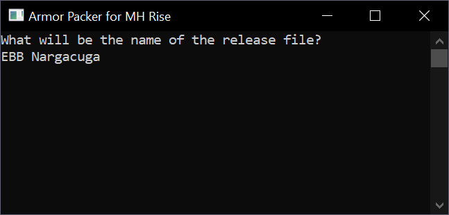

# Armor Packer

**Easily pack your MH Rise armor mods for distribution.**

This program generates a batch file that in turn runs [7-zip][] to compress some directory containing all the armors (and armor options) so it can be distributed as a Fluffy file with options.

# Usage

See [help topics](Help/010_index.md).

## Overview

This program expects you to have some particular structure to your files:

        Base directory\
            Mod to pack\
                config.ini
                (optional) packed name.txt

                Option 1
                    modinfo.ini
                    ...
                    (all files that will be distributed)

                Option 2
                    modinfo.ini
                    ...
                    (all files that will be distributed)

When used, it will generate a \*.bat file inside `Base directory\`.

That \*.bat file will generate your distributable mod file once used.

## How to use

With the structure above you can drag and drop `Mod to pack\` to `ArmorPacker.exe`, and then the program will ask you to give a name to your file.



Then it will create and execute a \*.bat file that compresses all files, ready to distribute.

## Detailed instructions by example

Let's suppose we have made the following mods:

```
My modded armors\
    Kamura\
        ...
    Malzeno\
        ...
    Nargacuga\
        ...
    Seregios\
        ...
```

And we want to pack Nargacuga.

First we need to make sure it has a config.ini file, so this program can process it.

```
My modded armors\
    Kamura\
        ...
    Malzeno\
        ...
    Nargacuga\
        config.ini
        ...
        EBB Nargacuga.txt

        Base\

    Seregios\
        ...
```

Let's ignore the rest of the armors and list only the files in `Nargacuga\`.

```
My modded armors\
    Nargacuga\
        config.ini
        EBB Nargacuga.txt

        Base\
            modinfo.ini
            screen.jpg

            f_body080.mesh.2109148288
            f_leg080.mesh.2109148288

            Source\
                body.blend
                leg.blend

        Skimpy\
            modinfo.ini
            screen.jpg

            f_body080.mesh.2109148288
            f_leg080.mesh.2109148288

```

When `My modded armors\Nargacuga\` is dragged to the app, then entering this:


You will find a new file named `My modded armors\EBB Nargacuga.bat`, which in turn will create `My modded armors\EBB Nargacuga.7z` when double clicked.

### Fast creation

An alternate and faster way to create `My modded armors\EBB Nargacuga.bat` file would be to drag and drop `My modded armors\Nargacuga\EBB Nargacuga.txt`.

In that case, the program recognizes you want to process `My modded armors\Nargacuga\` and want to name the result file `EBB Nargacuga`.

If you dropped a file named `My modded armors\Nargacuga\Main mod.txt`, the folder to process would have been `My modded armors\Nargacuga\` once again, but you would have got `My modded armors\Main mod.bat`, which would create `My modded armors\Main mod.7z` instead.

## Required files

### config.ini

`config.ini` is required so the program knows what to include in the 7z file and where to put it.

In this case, it has these lines:

```
modInternalPath=natives\STM\player\mod\f\pl080
extensions=mdf2,mesh
```

This tells the program you only want to include files with the extensions `.mdf2` and `.mesh` and they will be put inside the `mod option x\natives\STM\player\mod\f\pl080` folder once they are compressed.

If for some reason you wanted to include the Blender files, you would do this:

```
modInternalPath=natives\STM\player\mod\f\pl080
extensions=mdf2,mesh,blend
```

They would be also added to `mod option x\natives\STM\player\mod\f\pl080\` inside your \*.7z file.

It's important to remark **_all files you define in `extensions` this file will be compressed to `modInternalPath`_**.\
If you want to know how image files used by Fluffy are adde, read the next section.

### modinfo.ini

Any subfolder containing a file named `modinfo.ini` will be considered an option for your armor, since that file is actually the way Fluffy groups related mods together.

**Any folder without that file won't be ever considered to be added to the compressed distributable file**.

This program only cares about two particular lines inside `modinfo.ini`:

```
name=
screenshot=
```

The path you put in `screenshot` is the image that will be shown inside Fluffy, and that file will be automatically added to be compressed.

The `name` line will be used to name the internal folder name for the option inside the distributable file.

## Pulling everything together

If we had these files:

```
My modded armors\
    Kamura\
        ...

    Malzeno\
        ...

    Nargacuga\
        config.ini
        EBB Nargacuga.txt

        Base\
            modinfo.ini
            screen.jpg

            f_body080.mesh.2109148288
            f_leg080.mesh.2109148288

            Source\
                body.blend
                leg.blend

        Skimpy\
            modinfo.ini
            screen.jpg

            f_body080.mesh.2109148288
            f_leg080.mesh.2109148288

    Seregios\
        ...
```

With `Nargacuga\config.ini`:

```
modInternalPath=natives\STM\player\mod\f\pl080
extensions=mdf2,mesh
```

And `Nargacuga\Base\modinfo.ini`:

```
name=00 - Main mod
screenshot=screen.jpg
author=bla
description=bla bla bla
```

And `Nargacuga\Skimpy\modinfo.ini`:

```
name=Skimpy version
screenshot=screen.jpg
author=bla
description=bla bla bla
```

When dragging `Nargacuga\EBB Nargacuga.txt` to `ArmorPacker.exe` we would get:

        My modded armors\EBB Nargacuga.bat

Which when run, would generate:

        My modded armors\EBB Nargacuga.7z

With this internal structure:

```
00 - Main mod\
    modinfo.ini
    screen.jpg

    natives\STM\player\mod\f\pl080
        f_body080.mesh.2109148288
        f_leg080.mesh.2109148288

Skimpy version\
    modinfo.ini
    screen.jpg

    natives\STM\player\mod\f\pl080
        f_body080.mesh.2109148288
        f_leg080.mesh.2109148288
```

# Wrapping up

You can play with many different settings and ideas to get aquainted with how the program works.

No files will be harmed in the process.

[7-zip]: https://www.7-zip.org/
